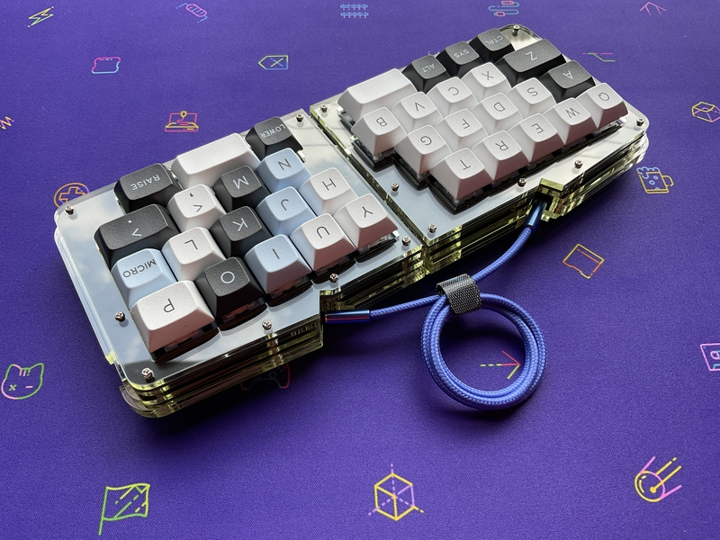

# cool936

## What is cool936?

cool936 is a split keyboard with a [qaz](https://www.cbkbd.com/product/qaz-keyboard-kit) layout.
 
[qaz](https://www.cbkbd.com/product/qaz-keyboard-kit)レイアウトの分割キーボードです。
 
 

## Build Guide
https://github.com/telzo2000/cool936/blob/main/buildguide_for_cool936.md

 

## Terms of use(使用条件)

You are free to duplicate the data related to cool936, place an order for PCB, etc. and use it personally.
 
cool936に関するデータを複製して、PCB等発注して個人で使用するのは自由です。
 
However, it is prohibited to give or receive money such as sales using the data ordered by an individual.
 
ただし、個人で発注したデータを使用して販売等、金銭の授受が発生することは禁止です。
 
The transfer of money as a manufacturing agent is also included in the prohibition.
 
製造代行と称しての金銭の授受も禁止に含まれます。
 
 

## What are coolxxx?

These keyboards is designed by m.ki.

|cool|another name|keyboard type|MCU|URL|Sales site|
| -- | -- | -- | -- | -- | -- |
|434|MyFirstMini|row|pro micro|none|none|
|445|none|row|pro micro & Raspberry Pi Pico|[Here](https://github.com/telzo2000/cool445)|none|
|536|none|column|pro micro|[Here](https://github.com/telzo2000/cool536)|none|
|544|Caravellion|column|pro micro|none|none|
|635|none|ortho|pro micro|[Here](https://github.com/telzo2000/cool635-)|none|
|640|none|ortho splite|pro micro & Raspberry Pi Pico|[Here](https://github.com/telzo2000/cool640)|in preparation|
|650|none|ortho splite|pro micro|[Here](https://github.com/telzo2000/cool650)|[Here](https://mki0002ozlet.booth.pm/items/3585417)|
|753|none|row|pro micro|none|none|
|836A|none|alice|pro micro|[Here](https://github.com/telzo2000/cool836A)|[Here](https://mki0002ozlet.booth.pm/items/2542223)|
|836pico|none|alice|Raspberry Pi Pico|[Here](https://github.com/telzo2000/cool836pico)|[Here](https://mki0002ozlet.booth.pm/items/3391829)|
|836rp|none|alice|RP2040-Zero|[Here](https://github.com/telzo2000/cool836pico)|[Here](https://mki0002ozlet.booth.pm/items/3599330)|
|844|none|alice|pro micro|[Here](https://github.com/telzo2000/cool844)|[Here](https://mki0002ozlet.booth.pm/items/2805606)|
|844V2|none|alice|pro micro|[Here](https://github.com/telzo2000/cool844V2)|[Here](https://mki0002ozlet.booth.pm/items/3267681)|
|847|none|alice|pro micro|[Here](https://github.com/telzo2000/cool847)|[Here](https://mki0002ozlet.booth.pm/items/3358065)|
|936|none|row splite|pro micro|[Here](https://github.com/telzo2000/cool936)|none|
|939|none|row splite|pro micro|[Here](https://github.com/telzo2000/cool939)|none|
|943S|none|row splite|pro micro|[Here](https://github.com/telzo2000/cool943S)|[Here](https://mki0002ozlet.booth.pm/items/2901779)|
|950S|none|row splite|pro micro|[Here](https://github.com/telzo2000/cool950S)|[Here](https://mki0002ozlet.booth.pm/items/3160071)|

